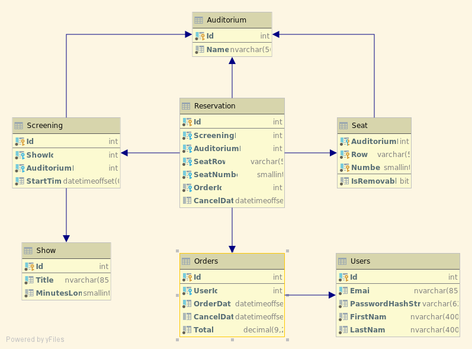

# Database Schema for Movie Ticket Booking System

## Database Engine

This schema uses Microsoft SQL Server 2017.

## Data Type Conventions

### Date and Time Values

- All date and time values use [`DATETIMEOFFSET`](https://docs.microsoft.com/en-us/sql/t-sql/data-types/datetimeoffset-transact-sql?view=sql-server-2017) to maintain time-zone awareness.
- No data type in SQL Server 2017 is daylight-saving-time aware on its own, and [`AT TIME ZONE`](https://docs.microsoft.com/en-us/sql/t-sql/queries/at-time-zone-transact-sql?view=sql-server-2017) relies on an operating-system-specific mechanism.  Specifically, `AT TIME ZONE` _could_ behave differently on Linux than on Windows.  For these reasons and others, handle time-zone conversions&mdash;carefully&mdash;in client code, not SQL.
- SQL Server 2017 has no suitable timespan data type, so durations use appropriate integer types.

### Numeric Values

- The 32-bit signed `INT` value is reasonable for `IDENTITY` columns.
- Money amounts use `DECIMAL(9,2)`, providing seven digits before and two digits after the decimal point.  The precision of 9 is the [largest that can remain within five bytes of storage](https://docs.microsoft.com/en-us/sql/t-sql/data-types/decimal-and-numeric-transact-sql?view=sql-server-2017#arguments).
- [`MONEY` historically has issues](https://www.red-gate.com/hub/product-learning/sql-prompt/avoid-use-money-smallmoney-datatypes), so do not use it.

### Text Values

- Nonclustered index fields for one row cannot exceed 1,700 bytes, so unique text columns like `dbo.Show.Title` cannot exceed `NVARCHAR(850)`.  `NVARCHAR` types use UTF-16 encoding, so they use two bytes per character.

## Naming Conventions

- Specify the default schema `dbo` explicitly.
- All constraints must have defined names.
- Table names are singular unless that name would be a [reserved keyword](https://docs.microsoft.com/en-us/sql/t-sql/language-elements/reserved-keywords-transact-sql?view=sql-server-2017).
- References to tables with plural names treat the table name as singular.  For example, use `OrderId` to refer to the `dbo.Orders` primary-key column `Id`.
- Name standalone `IDENTITY` columns `Id` without including the table name.

## Design Decisions

- This schema represents only one multiplex facility.  That is, the schema does not yet support multiple theater locations.  However, details such as time zones are part of the schema now, so adding locations should not be too much extra work should the need arise.
- The schema does not consider different seating types, such as "balcony" or "box" seating.
- For simpler database design, the schema assumes [continental seating](http://web.archive.org/web/20161023225348/http://www.theatresolutions.net/auditorium-seating-layout/#general-seating).  No information about aisles is part of the schema.

## Specific Technical Decisions and Explanations

### `dbo.Orders`

- The default constraint for `OrderDate` arguably contradicts the earlier advice about not manipulating time zones in SQL.  But, creation-date defaults are typical, and developers may expect one.
- [Random.org](https://random.org/) chose the identity seed of 24696.  Because an order ID may be user-visible, starting from 1 may be undesirable.

### `dbo.Reservation`

- It may be convenient to know when a reservation was canceled, so `CancelDate` is a `DATETIMEOFFSET` rather than a bit flag.
- The unique index is filtered to include only non-canceled reservations.  Any number of canceled reservations may refer to the same screening and seat.  The filter does not allow this unique index to be the clustered index, so the table still has an `Id` column as its primary key.

### `dbo.Screening`

- The unique key on `Id` and `AuditoriumId` is for referential integrity from `dbo.Reservation`.  As `Id` is already unique, adding this unique key is redundant; however, SQL Server requires foreign keys to refer to either a primary key or a unique key.
- It is not possible to use SQL Server's constraints to ensure that shows do not overlap in the same auditorium.  Ensuring different start times is the best we can do without resorting to triggers.  Adding the end time would not help, and we can compute the end time using `dbo.Show.MinutesLong`, so we should not store an end time in this table.

### `dbo.Seat`

- This table will rarely change, and references to `dbo.Seat` may want to ensure the correct auditorium.  So, instead of an `IDENTITY` column, the seat's "coordinates" (`AuditoriumId`, `Row`, and `Number`) serve as the primary key.  The extra safety justifies the additional few bytes in each row of `dbo.Reservation`.
- `Number` is, in fact, a number rather than a string.  Using a number eases determining which seats are adjacent, though the schema does not contain any logic to determine adjacency.
- The schema does not account for modifying a row or number, which would be rare.  Reconfiguring an auditorium's seating might involve creating a new row in `dbo.Auditorium`, in which case a new set of `dbo.Seat` rows is required.

### `dbo.Show`

- `Title` is unique to avoid user-interface confusion later.  A title might include a year to disambiguate, like [_Aladdin (2019)_](https://www.imdb.com/title/tt6139732/?ref_=ttls_li_tt).
- 32,767 minutes is plenty of length for a movie, so `SMALLINT` is appropriate.
- Although `Title` is unique, I included `Id` so that foreign-key references may use four bytes instead of up to 1,700.

### `dbo.Users`

- `PasswordHashString` accommodates a [bcrypt hash string](https://en.wikipedia.org/wiki/Bcrypt#Description), as [OWASP currently suggests](https://cheatsheetseries.owasp.org/cheatsheets/Password_Storage_Cheat_Sheet.html).
- `Email` servers as the login ID.  However, a user's email can change, so `Email` is not the primary key.

## Database Creation

### Order of Table Creation

This ordering works for a new database.

1. `dbo.Users`
2. `dbo.Orders`
3. `dbo.Show`
4. `dbo.Auditorium`
5. `dbo.Seat`
6. `dbo.Screening`
7. `dbo.Reservation`

### PowerShell Script

[Installing dbatools](https://dbatools.io/getting-started/) in PowerShell allows running [`CreateDatabase.ps1`](Setup/CreateDatabase.ps1) to create the database and those tables.  Modify the `Connect-DbaInstance` statement for your environment.  The script is not idempotent.

## Schema Diagram

